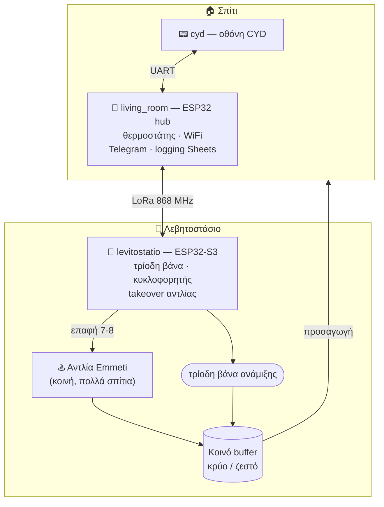

# 🔥 Samster's Land HESTIA

[🇬🇧 English](README.md) · **🇬🇷 Ελληνικά**

Αυτόνομο (χωρίς cloud, χωρίς Home Assistant) σύστημα ελέγχου **θέρμανσης & δροσισμού** με
**LoRa point-to-point**, για μια **κοινή αντλία θερμότητας** που εξυπηρετεί πολλά σπίτια από
κοινό buffer. Χτισμένο σε **ESP32 / PlatformIO**.

Το σύστημα αναλαμβάνει έξυπνα την αντλία (takeover μέσω dry-contact), κρατά δυναμική
προσαγωγή με προστασία σημείου δρόσου, εξισορροπεί ηλιακή προτεραιότητα τον χειμώνα, και
καταγράφει τα πάντα σε Google Sheet + Telegram.

## 🧩 Αρχιτεκτονική



| Environment | Board | Ρόλος |
|-------------|-------|-------|
| `levitostatio` | ESP32-S3 | Ελεγκτής λεβητοστασίου: τρίοδη βάνα, κυκλοφορητής, takeover αντλίας, αισθητήρες buffer |
| `living_room` | ESP32 dev | Κόμβος σπιτιού: θερμοστάτης, WiFi, Telegram, logging στο Sheet, γέφυρα UART προς CYD |
| `cyd` | CYD (ESP32 + οθόνη) | Οθόνη/χειριστήριο μέσω UART |

Επικοινωνία κόμβων: **LoRa 868 MHz** (LR1121 / RadioLib).

## ⚙️ Στήσιμο

```bash
# 1. Κλωνοποίηση
git clone https://github.com/Juniorlef11/samsters-land-hestia.git
cd samsters-land-hestia

# 2. Διαπιστευτήρια (ΥΠΟΧΡΕΩΤΙΚΟ — δεν ανεβαίνουν ποτέ)
cp include/secrets.h.example include/secrets.h
#   -> βάλε WiFi, Telegram token/chat id, (προαιρετικά) Google Sheets URL

# 3. Build / Upload ανά κόμβο
pio run -e levitostatio -t upload
pio run -e living_room  -t upload
pio run -e cyd          -t upload
```

Απαιτείται [PlatformIO](https://platformio.org/). Οι βιβλιοθήκες κατεβαίνουν αυτόματα.

## 📁 Δομή

```
src/levitostatio/   ελεγκτής λεβητοστασίου (S3)
src/living_room/    κόμβος σπιτιού / hub
src/cyd/            οθόνη
include/secrets.h   ΙΔΙΩΤΙΚΟ (gitignored) — από το .example
tools/              Google Apps Script + βοηθητικά scripts
docs/               τεχνικό εγχειρίδιο, σχέδιο PCB, checklist
```

## 📚 Τεκμηρίωση

- `docs/Samsters Land HESTIA - Manual.pdf` — τεχνικό εγχειρίδιο
- `docs/Baseboard_PCB_Design.md` — σχέδιο baseboard PCB
- `docs/Stage3_Tuning_Checklist.md` — λίστα κουρδίσματος

## 📄 Άδεια χρήσης

**PolyForm Noncommercial 1.0.0** — δείτε [`LICENSE`](LICENSE).

Ελεύθερο για μη-εμπορική χρήση (μελέτη, hobby, εκπαίδευση). **Η εμπορική χρήση
απαγορεύεται** χωρίς γραπτή άδεια. Για εμπορική αδειοδότηση, επικοινωνήστε με τον δημιουργό.

© 2026 Konstantinos Lefevr — Marathon, Greece.
