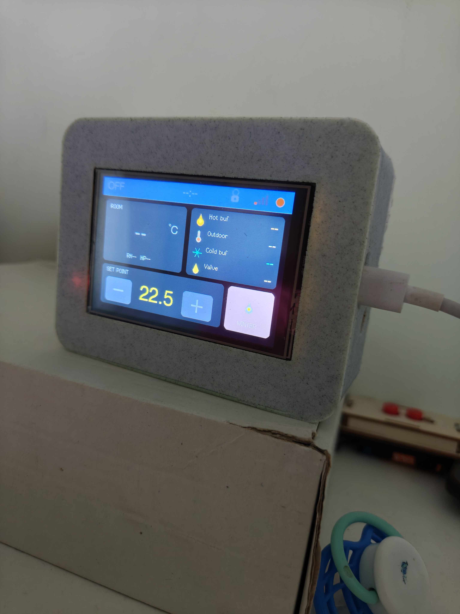
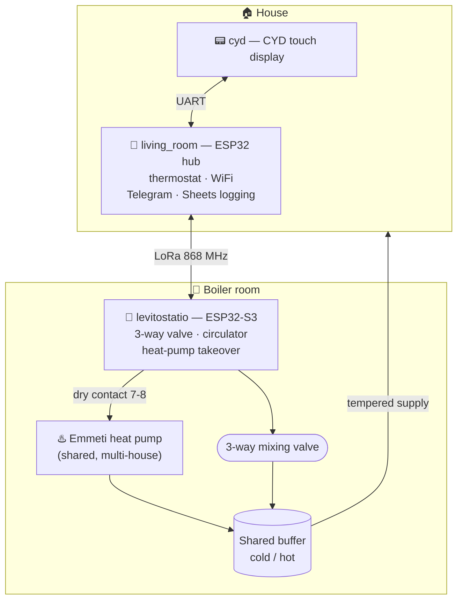
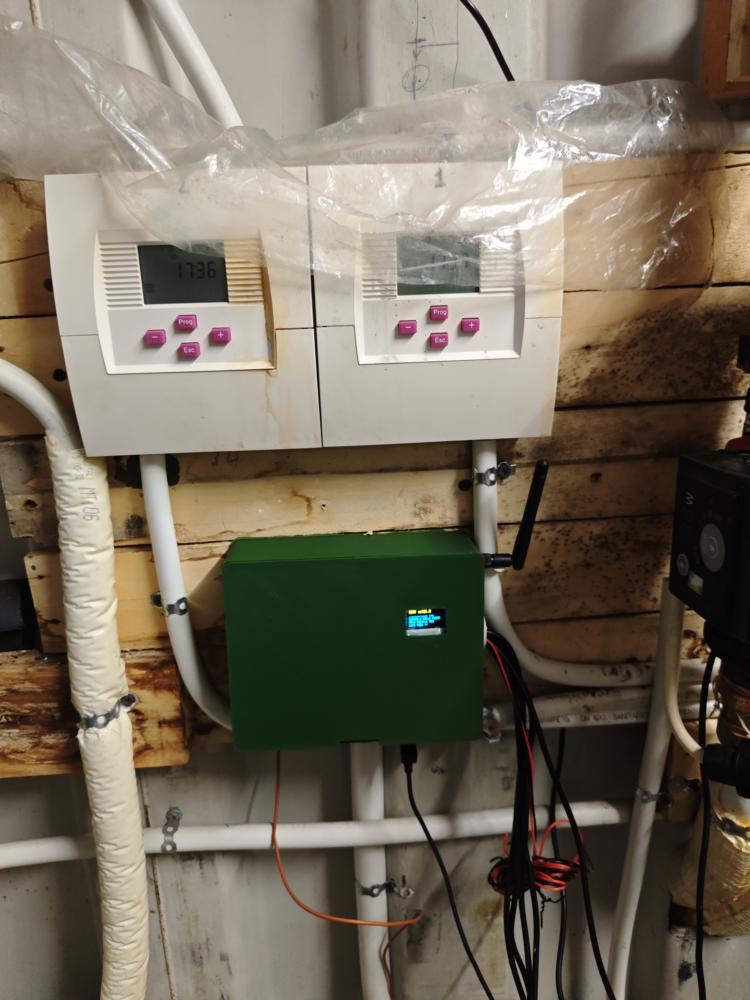
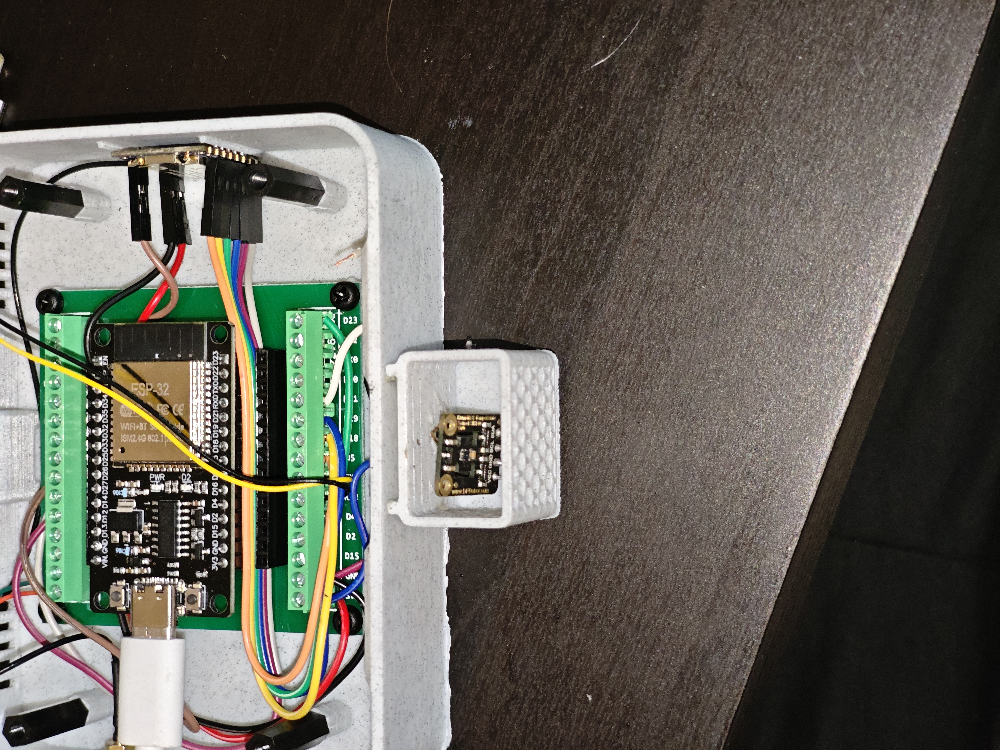
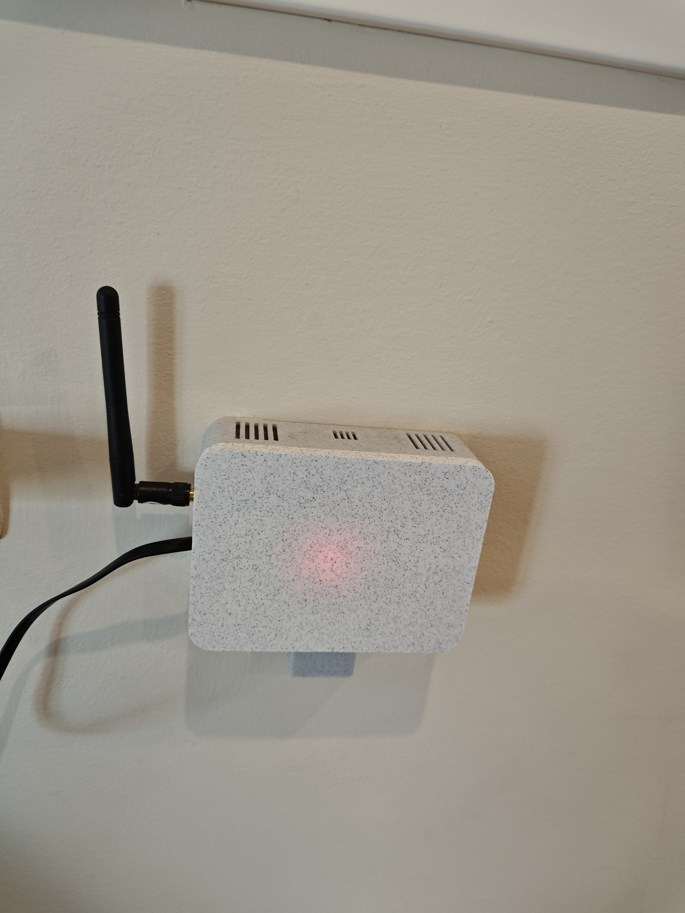

# 🔥 Samster's Land HESTIA

**🇬🇧 English** · [🇬🇷 Ελληνικά](README.el.md)

A standalone (no cloud, no Home Assistant) control system for **heating & cooling** over
**LoRa point-to-point**, driving a **shared heat pump** that serves multiple houses from a
common buffer tank. Built on **ESP32 / PlatformIO**.

The system intelligently takes over the heat pump (via a dry-contact), keeps a dynamic
supply temperature with dew-point protection, prioritises solar heat in winter, and logs
everything to a Google Sheet + Telegram.



## 🧩 Architecture



| Environment | Board | Role |
|-------------|-------|------|
| `levitostatio` | ESP32-S3 | Boiler-room controller: 3-way valve, circulator, heat-pump takeover, buffer sensors |
| `living_room` | ESP32 dev | House node: thermostat, WiFi, Telegram, Google-Sheets logging, UART bridge to CYD |
| `cyd` | CYD (ESP32 + display) | Touch display / control panel over UART |

Node link: **LoRa 868 MHz** (LR1121 / RadioLib).

## 🛠️ Hardware

| Boiler room | Node internals | Wall-mounted node |
|:---:|:---:|:---:|
|  |  |  |
| Emmeti thermostats + LoRa node | ESP32 + baseboard PCB + SHT40 sensor | House node, wall-mounted |

## ⚙️ Setup

```bash
# 1. Clone
git clone https://github.com/Juniorlef11/samsters-land-hestia.git
cd samsters-land-hestia

# 2. Credentials (REQUIRED — never committed)
cp include/secrets.h.example include/secrets.h
#   -> fill in WiFi, Telegram token/chat id, (optional) Google Sheets URL

# 3. Build / Upload per node
pio run -e levitostatio -t upload
pio run -e living_room  -t upload
pio run -e cyd          -t upload
```

Requires [PlatformIO](https://platformio.org/). Libraries are fetched automatically.

## 📁 Structure

```
src/levitostatio/   boiler-room controller (S3)
src/living_room/    house node / hub
src/cyd/            display
include/secrets.h   PRIVATE (gitignored) — from the .example
tools/              Google Apps Script + helper scripts
docs/               technical manual, PCB design, checklist
```

## 📚 Documentation

- `docs/Samsters Land HESTIA - Manual.pdf` — technical manual
- `docs/Baseboard_PCB_Design.md` — baseboard PCB design
- `docs/Stage3_Tuning_Checklist.md` — tuning checklist

## 📄 License

**PolyForm Noncommercial 1.0.0** — see [`LICENSE`](LICENSE).

Free for **non-commercial** use (study, hobby, education). **Commercial use is prohibited**
without written permission. For commercial licensing, contact the author.

© 2026 Konstantinos Lefevr — Marathon, Greece.
